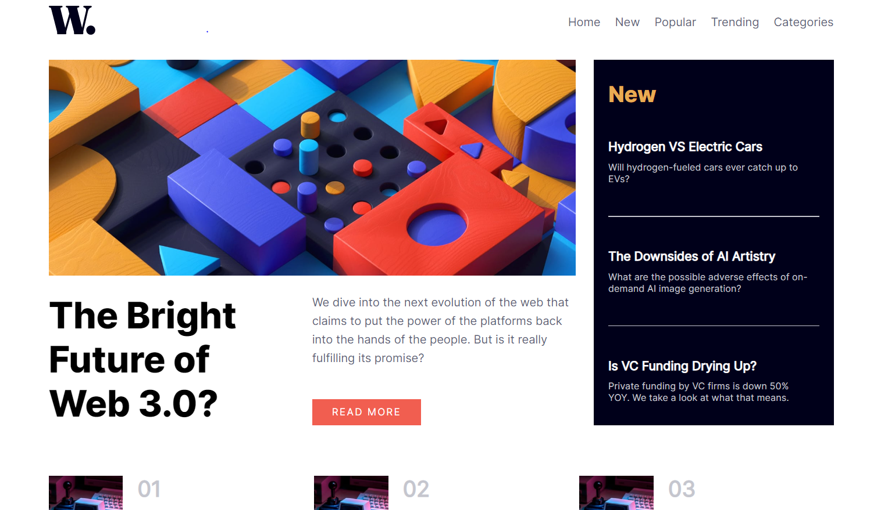

# Frontend Mentor - News homepage solution

# Links

- Live Site URL: [https://idyllic-phoenix-bf9734.netlify.app/](https://idyllic-phoenix-bf9734.netlify.app/)

# Screenshot

This is a solution to the [News homepage challenge on Frontend Mentor](https://www.frontendmentor.io/challenges/news-homepage-H6SWTa1MFl). 

# The challenge

Users should be able to:

- View the optimal layout for the interface depending on their device's screen size
- See hover and focus states for all interactive elements on the page
- **Bonus**: Toggle the mobile menu (requires some JavaScript)

### Built with

-HTML
-SCSS
-JS
